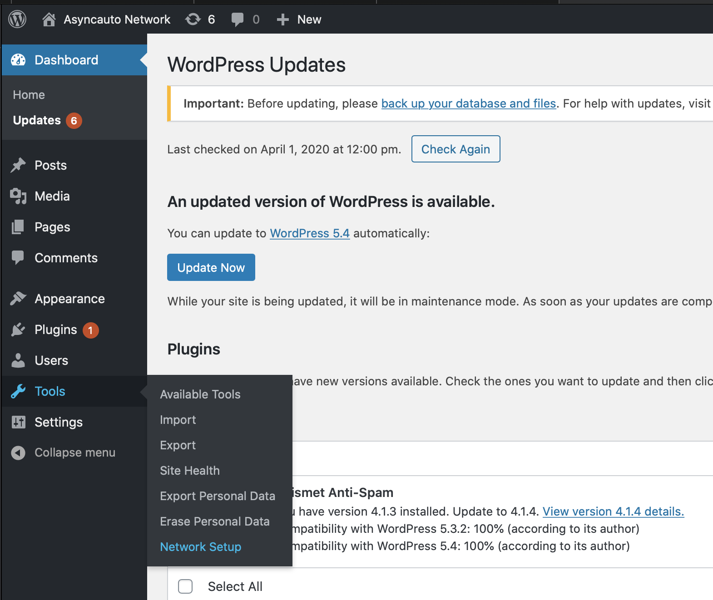
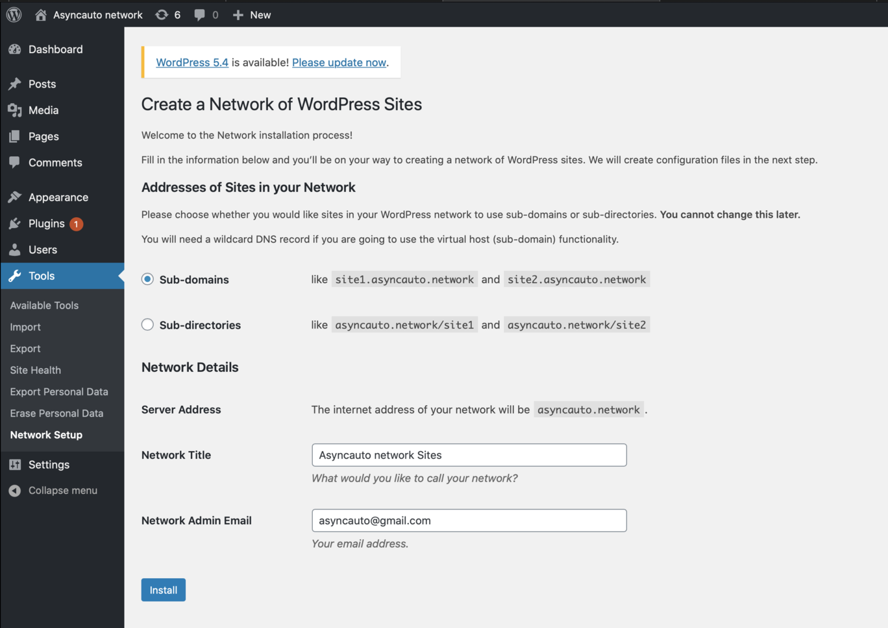

# Wordpress
For marketing pages, we usually pick between these options: 
- wordpress 
- static site generators
- sailsjs 

## Best suited for
Wordpress is best suited for marketing site, 

- you have a seperate team for marketing. 
- landing pages are not build using data from your app database. 

If you are building landing pages which displaying data from your app, we usually tend to prefer sailsjs. 

If you have non developers contributing to landing pages, then wordpress is a good fit. 

## Open source vs Hosted wordpress
Being developers, we prefer the open source verion of wordpress. The open source version is more customisable. Also multisite can make this super cost effective. 

## Multi site vs Single site
Multi site is a bit more complicated than setting up the single site. If you are someone who is working with multiple products, then running multiple wordpress server will not be cost effective. 

## Setup wordpress multi site

### Stack

- Wordpress
- Mysql
- Docker
- S3
- Amazon linux
- Elastic beanstalk

### Setup s3 bucket
We will be auto syncing the wp-content folder in the server with s3 on period manner.
create a s3 bucket.

1. assign this bucket policy. 
2. This policy makes sure elastic beanstalk has access to the bucket
```
{
    "Version": "2008-10-17",
    "Statement": [
        {
            "Sid": "beanstalk",
            "Effect": "Allow",
            "Principal": {
                "AWS": "arn:aws:iam::<account>:role/aws-elasticbeanstalk-ec2-role"
            },
            "Action": [
                "s3:Get*",
                "s3:List*",
                "s3:PutObject"
            ],
            "Resource": [
                "arn:aws:s3:::<bucket>/*",
                "arn:aws:s3:::<bucket>"
            ]
        }
    ]
}
```

### Setup beanstalk Part:1
choose the environment platform as docker


Disable proxy server


#### Configure env variables

WORDPRESS_CONFIG_EXTRA 
define('FS_METHOD', 'direct');
define( 'WP_ALLOW_MULTISITE', true );

WORDPRESS_DB_HOST
 mysql database host

WORDPRESS_DB_NAME
mysql database name

WORDPRESS_DB_PASSWORD
mysql database password

WORDPRESS_DB_USER
mysql database user

Get the beanstalk url and map it to the domain name you defined in the environment variable. In this example it's asyncauto.network

#### Setup the code

1. clone the multisite open source repo 
2. replace `my-s3-bucket` in `.ebextensions/wp.config` with your bucket you have created
3. commit the code.
4. setup eb-cli and deploy the code.

#### Setup Wordpress Part:1

1. goto asyncauto.network and signup.
2. goto network setup


3. choose sub-domains and install


### Setup beanstalk Part:2
Replace this environment variable and apply the configuration

WORDPRESS_CONFIG_EXTRA 
```
define('FS_METHOD', 'direct');
define( 'WP_ALLOW_MULTISITE', true );
define('MULTISITE', true); 
define('SUBDOMAIN_INSTALL', true); 
define('DOMAIN_CURRENT_SITE', 'asyncauto.network');
define('PATH_CURRENT_SITE', '/'); 
define('SITE_ID_CURRENT_SITE', 1); 
define('BLOG_ID_CURRENT_SITE', 1);
define('COOKIE_DOMAIN', $_SERVER['HTTP_HOST']);

```